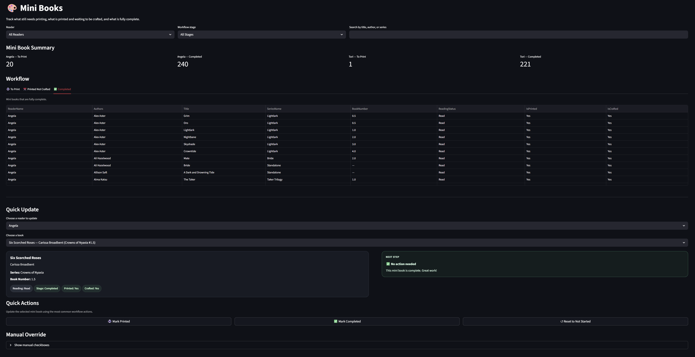
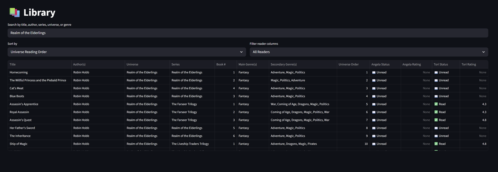
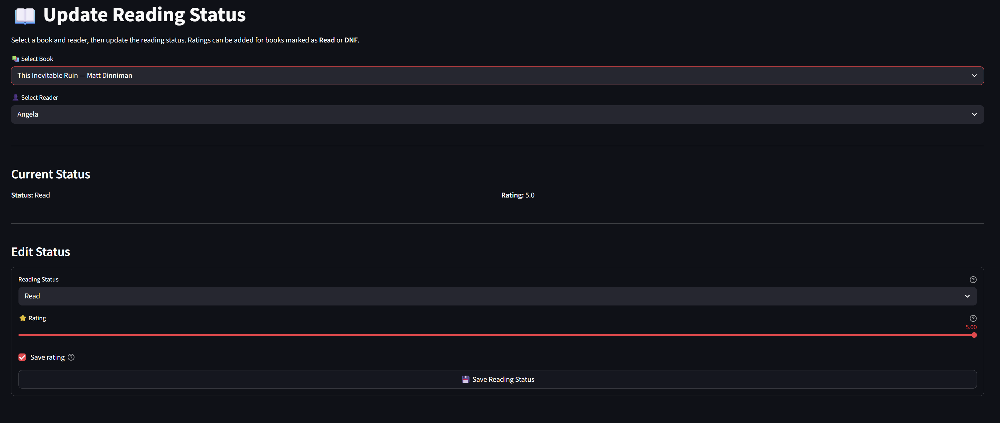
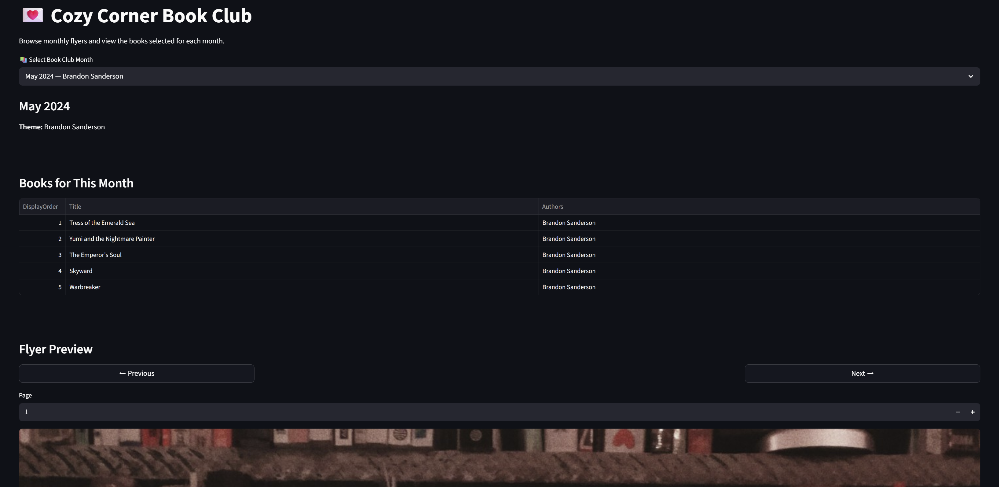
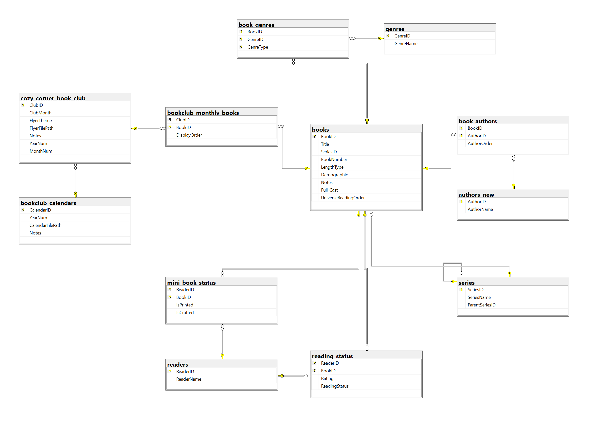

# Audiobooks Database Schema

<p align="center">
  
</p>

<p align="center">
  <em>Mini Book workflow dashboard with stage tracking, quick actions, and guided next steps</em>
</p>

This project is a fully normalized SQL Server database paired with a Streamlit web application for managing audiobook collections, reader activity, and physical “mini book” crafting workflows.

Originally built as a hands-on SQL learning project, it has evolved into a feature-rich data system with real-world workflows, automation logic, and a user interface.

## Key Features

### Core Library Management

- Normalized book, author, and series structure
- Many-to-many relationships for:
    - Authors (`book_authors`)
    - Genres (`book_genres`)
- Support for:
    - Series and parent series (universe grouping)
    - Book ordering within series and universes

### Reader Tracking System

- Per-reader:
    - Reading status (Unread, TBR, Reading, Read, DNF)
    - Ratings (0–5 scale)
- Fully normalized via `reading_status`

### Mini Book Workflow System (NEW)

A custom workflow for tracking physical mini book creation:
- Tracks per-reader progress
    - `IsPrinted`
    - `IsCrafted`
- Enforced business rule:
    - A mini book cannot be crafted unless it is printed

Workflow stages are automatically derived via view:
- To Print
- Printed Not Crafted
- Completed

Supported by:
- `mini_book_status` table
- `vw_reader_mini_books_dashboard`
- `vw_reader_mini_books_dashboard_summary`
- `SetMiniBookStatus` stored procedure

### Cozy Corner Book Club
- Monthly book selections
- Themed reading lists
- PDF flyer + calendar integration

## Streamlit Web App


The project includes a multi-page Streamlit interface that allows users to interact with the database through a clean, workflow-driven UI.

---

### Mini Book Workflow Dashboard

<p align="center">
  
</p>

- Track progress across workflow stages:
  - To Print
  - Printed Not Crafted
  - Completed
- Visual status indicators and next-step guidance
- One-click updates for printing and crafting actions

---

### Library View

<p align="center">
  
</p>

- Search by title, author, series, universe, or genre
- View reader-specific progress and ratings
- Explore structured series and universe relationships

---

### Reading Status Management

<p align="center">
  
</p>

- Update reading progress per user
- Assign ratings dynamically
- Supports multiple reading states (Unread, TBR, Reading, Read, DNF)

---

### Cozy Corner Book Club

<p align="center">
  
</p>

- Monthly themed reading lists
- Ordered book selections
- Integrated flyer preview system

## Database Schema Overview

<p align="center">
  
</p>

The database is fully normalized and designed to support:
- complex relationships (many-to-many)
- multi-user tracking
- workflow-driven features (mini books)

### Core Tables

`books` - audiobook metadata

`authors_new` - normalized author list

`book_authors` - many-to-many book to author

`series` - series and universe hierarchy

`genres` / `book_genres` - categorized tagging

`readers` - users

`reading_status`- reader activity and ratings

`mini_book_status` - mini book workflow tracking

`cozy_corner_book_club` - monthly book club records

`bookclub_monthly_books` - book selections per month

`bookclub_calendars` - yearly planning data

### Relationships

Books ↔ Authors → many-to-many
Books ↔ Genres → many-to-many
Readers ↔ Books → via `reading_status`
Readers ↔ Mini Books → via `mini_book_status`
Book Club ↔ Books → monthly selections

### Key Views

Views are heavily used to simplify logic and support the UI:

**Core Views**
- vw_book_details
    → Aggregated authors, series, and universe data
- vw_reader_books
    → Reader activity across all books
**Mini Book Workflow Views**
- vw_reader_mini_books_dashboard
    → Assigns workflow stage per book
- vw_reader_mini_books_dashboard_summary
    → Aggregated counts per stage
- Stage-specific views:
    - To print
    - Printed not crafted
    - Completed

### Stored Procedures

Encapsulate reusable business logic:

- AddBook
    → Inserts book + authors + genres + seeds reader status
- SetReadingStatus
    → Updates reader progress (Unread → Read, etc.)
- SetReaderRating
    → Assigns ratings with validation
- UpdateBookGenres
    → Replaces genre assignments
- SetMiniBookStatus
    → Handles mini book workflow updates with constraints

## Getting Started

1. Create Database

```sql
CREATE DATABASE Audiobooks;
```

Run:

```plaintext
schema.sql
seed_data.sql
views.sql  
procedures.sql
```

2. Run the App

Create and activate a virtual environment:

```bash
python -m venv .venv
.venv\Scripts\activate
pip install -r requirements.txt
streamlit run app/app.py
```

## Project Structure

```plaintext
├── app/
│   ├── app.py
│   ├── db.py
│   └── pages/
│
├── sql/
│   ├── schema.sql
│   ├── seed_data.sql
│   ├── views.sql
│   ├── procedures.sql
│   ├── basic_queries.sql
│   └── analytics_queries.sql
│
├── requirements.txt
├── README.md
```

## Design Highlights
- Fully normalized relational schema
- Strong use of:
    - junction tables
    - aggregation (`STRING_AGG`)
    - computed workflow states via views
- Separation of concerns:
    - SQL = business logic
    - Streamlit = presentation layer
- Transaction-safe stored procedures (`XACT_ABORT`, transactions)
- Constraint-driven integrity:
    - e.g. mini book crafting rules

## Analytics Highlights

Example insights supported by this database:

- Books read per reader
- Shared books between readers
- Average ratings per reader
- Most-read genres
- Highest-rated books
- Reader-specific top books

## Example Query

*Example: Display books read by a specific reader with aggregated authors*
```sql
SELECT
    Authors,
    Title,
    SeriesName,
    BookNumber,
    Rating
FROM vw_tori_read_books
ORDER BY Authors, SeriesName, BookNumber;
GO
```

## Future Improvements

- Role-based contributors (Author / Narrator / Translator)
- Advanced analytics dashboards
- Cloud deployment (replace local SQL dependency)
- API layer between app and database
- Enhanced filtering + search UX in Streamlit

## Notes

This project reflects iterative database design improvements, including:

- schema normalization
- real-world workflow modeling
- UI-driven database evolution
- debugging and performance tuning